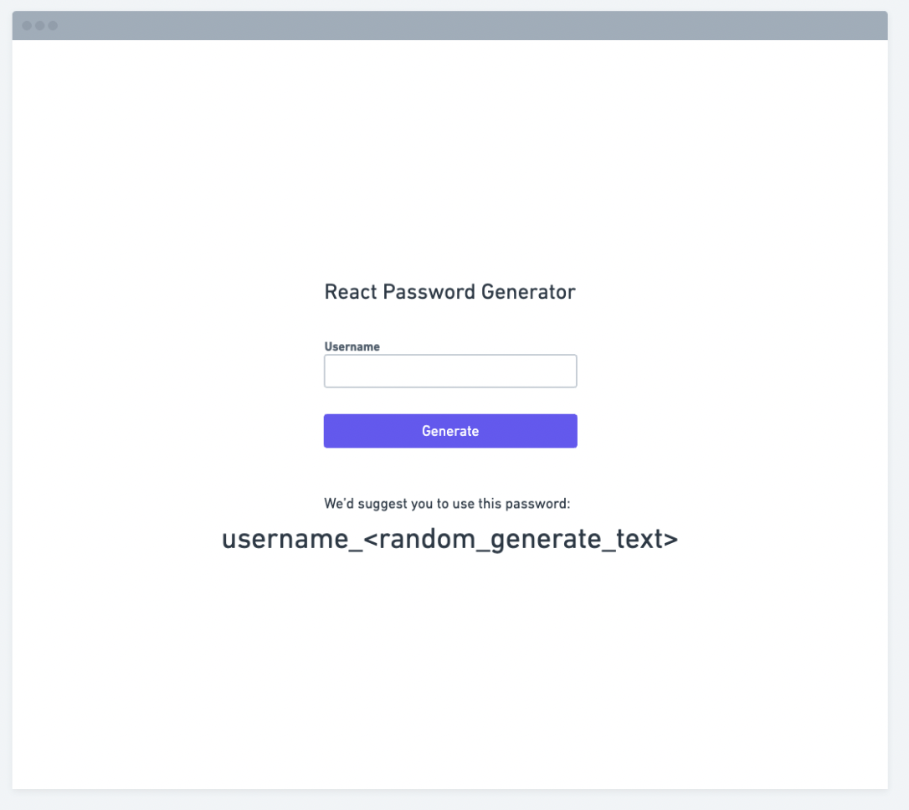

# Password Generator

## Petunjuk Pengerjaan
1. Buatlah suatu mini app **Berbasis React** yang akan generate password dari suatu username yang diberikan
2. Format password terdiri dari username_<generated_random_strings>
3. Berikan validasi sebagai berikut
- Ketika form kosong, maka alert akan tampil untuk memberitahu bahwa user tidak input dengan lengkap
- Username hanya berisi alpha numerik (a-z,A-Z,0-9) dan simbol (~!$ dsb.)
4. Buatlah UI setidaknya seperti gambar dibawah ini, bebas menggunakan CSS Utility atau framework apa saja jika membuat lebih kreatif akan menjadi nilai lebih

